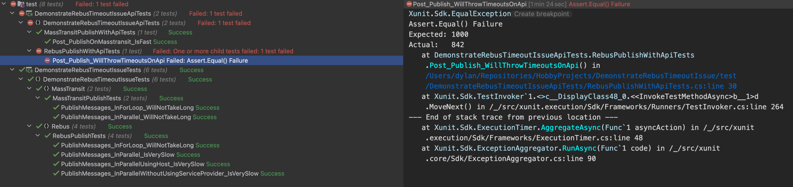

# Demonstrate Rebus Timeout Issue

This is a sample project to demonstrate the timeout issue we are getting on our production systems using Rebus with RabbitMQ

<!-- TOC -->
* [Demonstrate Rebus Timeout Issue](#demonstrate-rebus-timeout-issue)
  * [Getting started](#getting-started)
  * [Project structure](#project-structure)
  * [The exception thrown](#the-exception-thrown)
    * [Expected Result](#expected-result)
<!-- TOC -->

## Getting started

1. Clone this repository
2. Restore nuget packages
3. Run docker-compose.yml (contains rabbitmq service)
4. Run the tests

## Project structure

| folder                                           | description                                                                                                                                                                       |
|--------------------------------------------------|-----------------------------------------------------------------------------------------------------------------------------------------------------------------------------------|
| src/                                             | Contains sample API projects                                                                                                                                                      |
| src/DemonstrateRebusTimeoutIssueOnApi            | Contains sample web API project that utilizes Rebus                                                                                                                               |
| src/DemonstrateRebusTimeoutIssueOnApiMasstransit | Contains sample web API project that utilizes Masstransit                                                                                                                         |
| test/                                            | Contains tests demonstrating the issue                                                                                                                                            |
| test/DemonstrateRebusTimeoutIssueApiTests        | Contains tests invoking the sample api's resulting in timeouts. This is closest to what the issue we have on our production system.                                               |
| test/DemonstrateRebusTimeoutIssueTests           | Contains more isolated tests, these test unfortunately do not trigger the timeout. But it does take a very log time for some tests to complete compared to the Masstransit tests. |

## The exception thrown

```
[2023-12-08 13:47:20Z] fail: Microsoft.AspNetCore.Diagnostics.DeveloperExceptionPageMiddleware[1]
      An unhandled exception has occurred while executing the request.
System.TimeoutException: The operation has timed out.
   at RabbitMQ.Util.BlockingCell`1.WaitForValue(TimeSpan timeout)
   at RabbitMQ.Client.Impl.SimpleBlockingRpcContinuation.GetReply(TimeSpan timeout)
   at RabbitMQ.Client.Impl.ModelBase.ModelRpc(MethodBase method, ContentHeaderBase header, Byte[] body)
   at RabbitMQ.Client.Framing.Impl.Model._Private_ChannelOpen(String outOfBand)
   at RabbitMQ.Client.Framing.Impl.AutorecoveringConnection.CreateNonRecoveringModel()
   at RabbitMQ.Client.Framing.Impl.AutorecoveringConnection.CreateModel()
   at Rebus.RabbitMq.RabbitMqTransport.CreateChannel()
   at Rebus.Internals.WriterModelPoolPolicy.Create()
   at Rebus.Internals.ModelObjectPool.Get()
   at Rebus.RabbitMq.RabbitMqTransport.SendOutgoingMessages(IEnumerable`1 outgoingMessages, ITransactionContext context)
   at Rebus.Transport.AbstractRebusTransport.<>c__DisplayClass3_1.<<Send>b__1>d.MoveNext()
```
### Expected Result

The highlighted test below should pass because each of the 1000 request sent should be processed successfully.
However as the log will show, rebus is getting a timeout.
